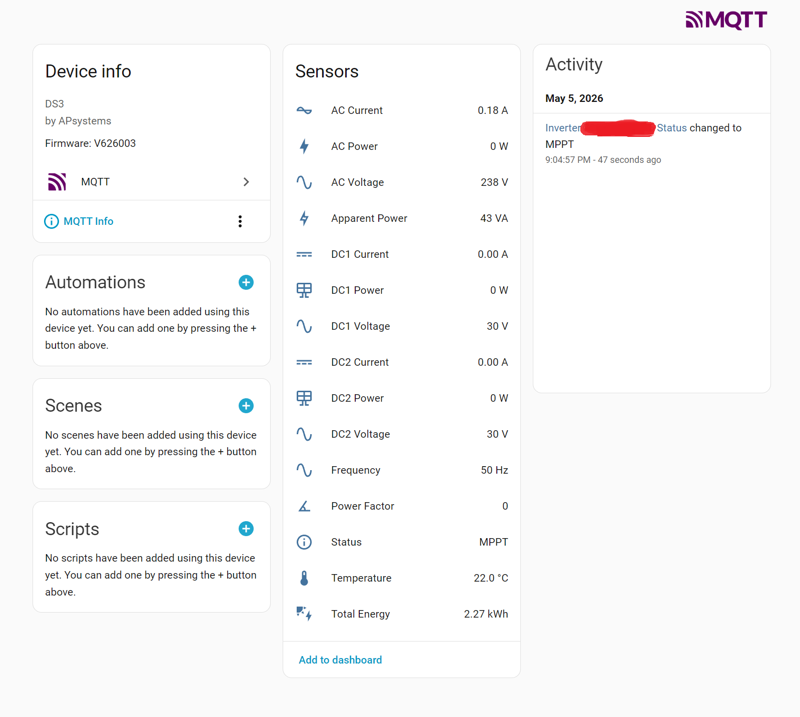

# ecu2mqtt
Read data from an APS ECU device using modbus-TCP and post it to an MQTT broker

## Setting up

You need an MQTT broker.

The ECU device host and port. 

You'll need to activate Modbus on your ECU device and assign ids to your inverters.

I have tested with an ECUC which is connected to my LAN with an ethernet cable.


### With docker run

```
docker run --rm -it \
    -e ECU_HOST=<ecu_host> \
    -e ECU_PORT=<echu_port> \
    -e MQTT_HOST=<mqtt_host> \
    -e MQTT_PORT=<mqtt_port> \
    -e MQTT_USER=<mqtt_user> \
    -e MQTT_PASSWORD=<mqtt_password> \
    -e INVERTER_IDS=<inverter_ids> \
    -e POLL_INTERVAL=<poll_interval> \
    -e ECU2MQTT_DEBUG=<debug> \
    ecu2mqtt
```

### With docker compose

Your docker-compose.yml file should contain:

```
services:
  ecu2mqtt:
    container_name: ecu2mqtt
    image: ecu2mqtt:latest
    restart: unless-stopped
    networks:
      - default
    environment:
      ECU_HOST: <ecu_host>
      ECU_PORT: <echu_port>
      MQTT_HOST: <mqtt_host>
      MQTT_PORT: <mqtt_port>
      MQTT_USER: <mqtt_user>
      MQTT_PASSWORD: <mqtt_password>
      INVERTER_IDS: <inverter_ids>
      POLL_INTERVAL: <poll_interval>
```

## Environment variables

`ECU_HOST`: the ip of the ECU device.

`ECU_PORT`: the port number of the ECU device for modbus. Optional with default value = 502.

`MQTT_HOST`, `MQTT_PORT`, `MQTT_USER`, `MQTT_PASSWORD`: the MQTT broker ip, port number, user name and password.

`INVERTER_IDS`: the inverter ids that you assigned to your inverters eg if you have 2 inverters with ids 1 and 2, specify 1,2 here.

`POLL_INTERVAL`: the poll interval in seconds ie how often data is asked from the ECU. Optional with default value = 300.

`ECU2MQTT_DEBUG`: if equal to 1, data is not published but written to the output. 
                  You can access the outputs using: `docker logs <container_id>`.

## Use in Home Assistant

If you have the MQTT integration set-up in Home Assistant, Home Assistant should discover devices automatically.

You should see one device per inverter with the following sensors:

